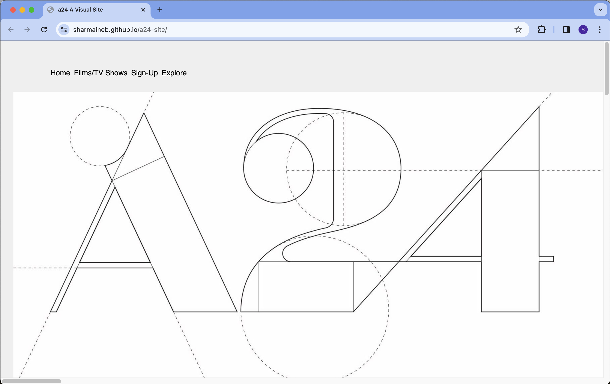

# A24: What Should I Watch?

### a24-intensive-redesign

A24 is a project that showcases a selection of films and television shows produced by A24 Films. It provides information about these works, including trailers, cast, and other details. This is a redesign of a project I worked on over a year ago and was the first intensive project I did during my time at ACS.

#### Screenshots of Previous Design


## Table of Contents

- [Introduction](#introduction)
- [Features](#features)
- [Project Structure](#project-structure)
- [Getting Started](#getting-started)
- [Usage](#usage)
- [License](#license)

## Introduction

This web application is designed to help users explore A24 Films' collection of movies and TV shows. A24 is known for its diverse range of critically acclaimed films and television series, and this project brings all the information you need in one place.

## Features

- Browse A24 Films' collection by categories: Films, Television, and Upcoming.
- View details of each work, including the title, director, cast, and a link to watch the trailer.
- Option to add your favorite films and shows to your list.
- Sign up for a newsletter to receive weekly updates.

## Project Structure

- `index.html`: The main HTML file containing the structure of the web page.
- `style.css`: The CSS file for styling the web page.
- `script.js`: The JavaScript file for handling interactivity and functionality.

## Getting Started

1. Clone this repository to your local machine:

   ```bash
   git clone <https://github.com/sharmaineb/a24-intensive-redesign.git>

## Usage

- Click on the "Show All," "Films," "Television," or "Upcoming" buttons to filter the content based on your preference.
- Click on the "Watch Trailer" buttons to watch trailers for the selected works.
- Use the "Add" button to add your films and shows to your watchlist.
- Use the "Favorites" button to add your favorite films and shows to your favorites.

## License

This project is licensed under the [MIT License](LICENSE) - see the [LICENSE](LICENSE) file for details.